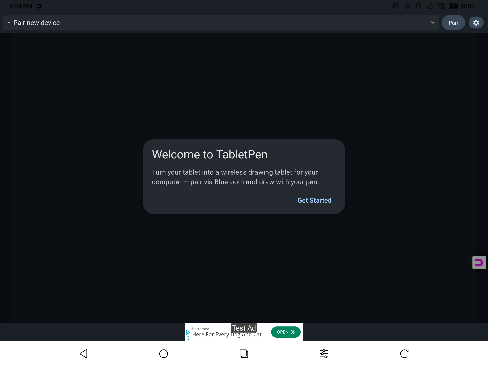
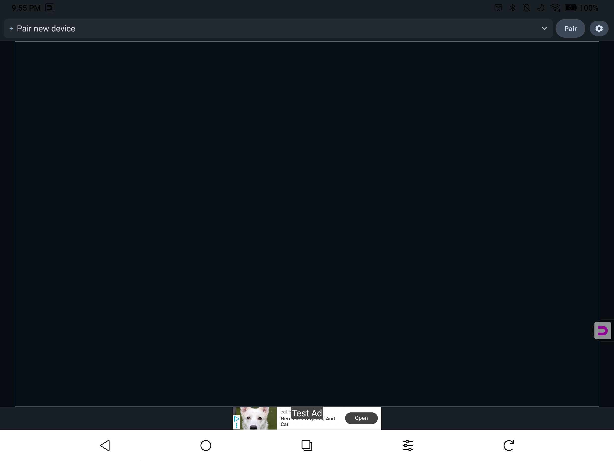
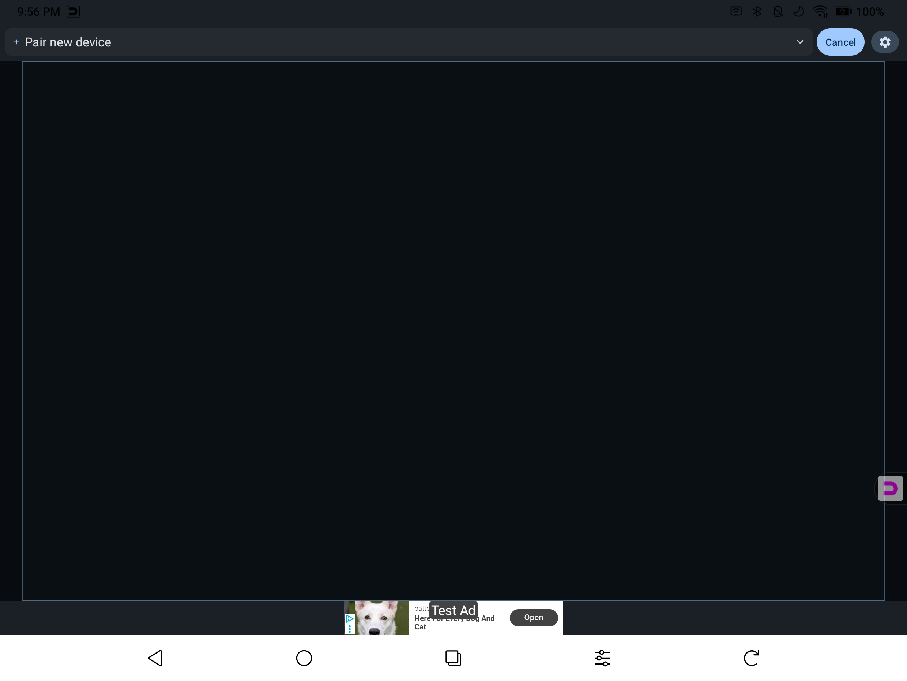

# Getting Started

Set up TabletPen in under 2 minutes. No software to install on your computer.

## What You Need

- An Android tablet with a stylus (Samsung Galaxy Tab, Boox, Lenovo, etc.)
- A computer with Bluetooth (Mac, Windows PC, or Chromebook)
- TabletPen installed from [Google Play](https://play.google.com/store/apps/details?id=com.tabletpen.app.lite)

## Step 1: Open the App

Launch TabletPen. On first launch, you'll see a welcome screen.

Tap **Get Started** to follow the interactive tutorial, or tap outside to set up on your own.

## Step 2: Tap Pair

Tap the **Pair** button in the top-right corner. This makes your tablet discoverable to nearby computers.

The button changes to **Cancel** while pairing is active. The "+" indicator in the device selector will pulse to show the tablet is waiting for a connection.

## Step 3: Connect from Your Computer

On your computer, open Bluetooth settings:

- **Mac:** System Settings > Bluetooth
- **Windows:** Settings > Bluetooth & devices
- **Chromebook:** Settings > Bluetooth

Find your tablet in the list (it will show its device name, e.g., "Galaxy Tab S9") and click **Connect** or **Pair**.

## Step 4: Start Drawing

Once connected, the indicator dot turns solid and the button shows **Disconnect**. Your pen now controls your computer.

- **Pen:** Moves the cursor and draws in any app (Photoshop, Krita, OneNote, etc.)
- **Fingers:** Work as a trackpad — one finger moves the cursor, two fingers scroll
- **Pressure & tilt:** Supported in apps that use them

## Next Steps

- [User Guide](user-guide) — Learn about all the gestures, modes, and settings
- [Troubleshooting](troubleshooting) — If pairing doesn't work on the first try

## Important Notes

- **Your computer initiates the connection**, not the tablet. Always connect from your computer's Bluetooth settings.
- If you've previously paired your tablet with this computer for other purposes (file transfer, etc.), **remove the old pairing first** from your computer's Bluetooth settings, then pair fresh with TabletPen.
- TabletPen works as a standard Bluetooth HID device — no drivers or host software needed on your computer.
