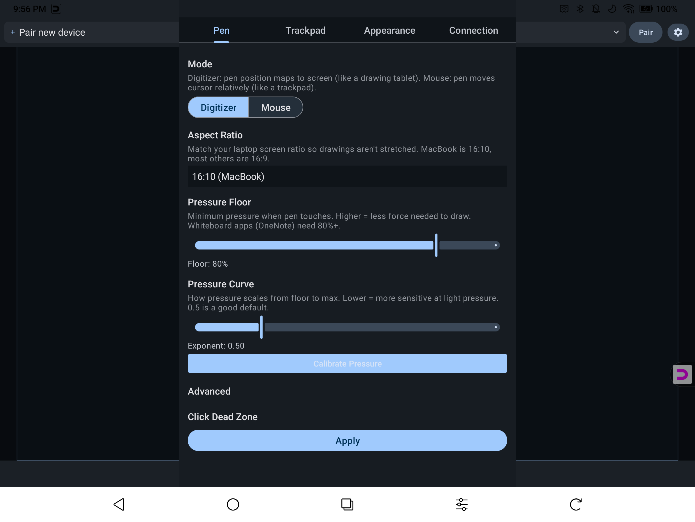

# User Guide

## Input Modes

TabletPen has two input modes, selectable in **Settings > Pen > Mode**:

### Digitizer Mode (Default)

Your pen position maps directly to your computer screen — like a Wacom tablet. Touch the top-left of your tablet, the cursor goes to the top-left of your screen.

- Best for: Drawing, painting, photo editing
- Pen pressure and tilt are sent to your computer
- The drawing area on your tablet matches your screen's aspect ratio

### Mouse Mode

Your pen moves the cursor relatively — like a trackpad. Drag your pen to move the cursor in that direction.

- Best for: General navigation, presentations, browsing
- One-finger drag moves the cursor
- Adjust speed in **Settings > Trackpad > Mouse Speed**

## Pen Input

- **Draw:** Touch the pen to the tablet surface. Pressure and tilt are sent to your computer.
- **Hover:** Move the pen above the surface to position the cursor without clicking.
- **Eraser:** Flip the pen (if your stylus has an eraser end) to use the eraser tool.
- **Barrel button:** Press the button on your stylus for a right-click.

## Touch / Trackpad Gestures

Your fingers work as a trackpad:

| Gesture | Action |
|---------|--------|
| One finger tap | Left click |
| One finger drag | Move cursor (mouse mode) |
| Two finger drag | Scroll |
| Two finger pinch | Zoom (Ctrl+scroll) |
| Double-tap and drag | Click-and-drag (like macOS trackpad) |

Double-tap-and-drag can be enabled in **Settings > Trackpad > Double-tap-and-drag**.

## Device Selector

The device selector in the top-left shows your paired computers.

- **Filled dot** — Connected and active (HID input flowing)
- **Hollow dot** — Bluetooth connected, available for quick switch
- **No dot, dimmed text** — Paired but not reachable (out of range or powered off)
- **+ Pair new device** — Enter pairing mode to add a new computer

Tap the selector to switch between computers. The dropdown shows the connection status of each device.

## Settings

Open settings by tapping the **gear icon** in the toolbar.

### Pen Tab

| Setting | Description |
|---------|-------------|
| **Mode** | Digitizer (absolute positioning) or Mouse (relative movement) |
| **Aspect Ratio** | Match your laptop screen: 16:10 for MacBook, 16:9 for most Windows laptops |
| **Pressure Floor** | Minimum pressure when pen touches. Raise this if your app needs more force to start a stroke. Whiteboard apps like OneNote need 80%+ |
| **Pressure Curve** | How pressure scales from light to heavy. Lower = more sensitive at light pressure. 0.5 is a good default |
| **Calibrate Pressure** | Run a 3-step wizard to auto-tune pressure floor and curve for your pen |

### Trackpad Tab

| Setting | Description |
|---------|-------------|
| **Mouse Speed** | Cursor movement speed for one-finger drag |
| **Scroll Speed** | Scrolling speed for two-finger drag |
| **Pinch Zoom** | Zoom sensitivity for pinch gestures |
| **Double-tap-and-drag** | Enable tap-tap-hold-drag for click-and-drag |

### Appearance Tab

| Setting | Description |
|---------|-------------|
| **Theme** | System, Light, or Dark |
| **Language** | System, English, Japanese, Korean, Simplified Chinese, Traditional Chinese |
| **Orientation** | Auto, Portrait, or Landscape |
| **Rotation** | 0/90/180/270 degrees — for mounted or flipped tablets |
| **Cursor Style** | None, Crosshair, Dot, or Circle shown on the tablet canvas |
| **Show pen strokes** | Toggle pen trail on the tablet canvas (visual feedback only — your computer always receives input) |
| **Stroke Color** | Auto, White, Black, Red, or Blue |

### Connection Tab

Shows detailed connection status, transfer speed, and diagnostics. Use **Copy Diagnostics** when reporting issues.

### About Tab

- App version
- Report Issue — send a bug report with device info and logs
- Show Tutorial — re-run the setup tutorial
- Upgrade to Pro (Lite only)
